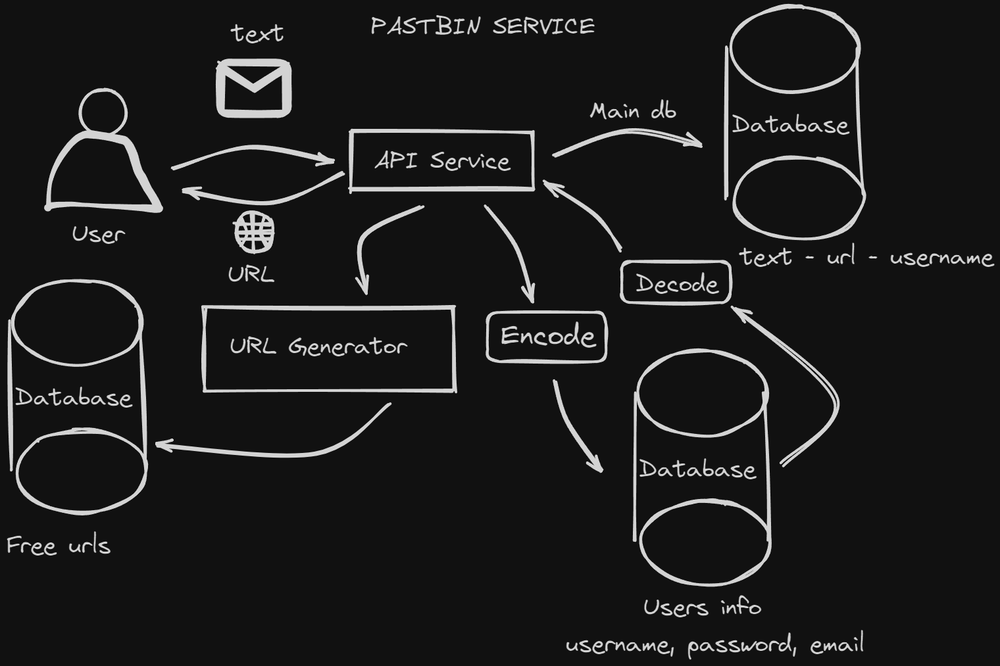

# Pastbin Service

Welcome to the **Pastbin Service**! This FastAPI-based web application allows users to securely register, log in, and post messages. With robust email verification and JWT-based authentication, this project offers a streamlined and secure experience for users.



## Features

- **User Registration and Login**: Secure authentication with email verification.
- **Message Posting**: Users can post messages that are associated with a unique hash identifier.
- **Email Verification**: Automated confirmation emails sent upon registration.
- **JWT Authentication**: Token-based authentication for secure user access.

## Installation

**Clone the repository:**

   ```bash
   git clone https://github.com/yourusername/pastbin-service.git
   cd pastbin_service
   ```

## Usage

**To run the application, start the FastAPI server:**
   ```bash
   uvicorn main:app --reload
   ```

## API Endpoints

### Authentication

- **GET** `/auth/register`: Displays the registration page.
- **POST** `/auth/register`: Handles user registration and sends a confirmation email.
- **GET** `/auth/login`: Displays the login page.
- **POST** `/auth/login`: Authenticates users and sets a JWT cookie.
- **GET** `/auth/logout`: Logs out the user by clearing the JWT cookie.
- **GET** `/auth/users/me`: Retrieves the current user's profile information.

### Message Handling

- **GET** `/pastbin/create_message`: Displays the create message page.
- **POST** `/pastbin/create_message`: Submits a new message.
- **GET** `/pastbin/message/{message_id}`: Retrieves a message by its ID.
- **GET** `/pastbin/all_messages`: Retrieves all messages.

### Email Verification

- **GET** `/auth/confirm/{token}`: Confirms the email address using a verification token.

## Error Handling

The application handles various errors such as:

- **400 Bad Request**: Invalid input or registration errors.
- **401 Unauthorized**: Authentication errors.
- **404 Not Found**: Resource not found.


##License
- This project is licensed under the MIT License. See the [LICENSE](LICENSE) file for more details.

##Contact me:
<p align="left">
<a href="https://t.me/yevlad" target="blank"></a>
  <a href="https://mail.google.com/mail/u/0/#inbox?compose=CllgCJfmrfWTDsVMGSfnJnRflxbjFsntNGdjCscFqqTwXNlCJbztnJwqlPNNHTGXhQrTgGQGtDB" target="blank"></a>
</p>
